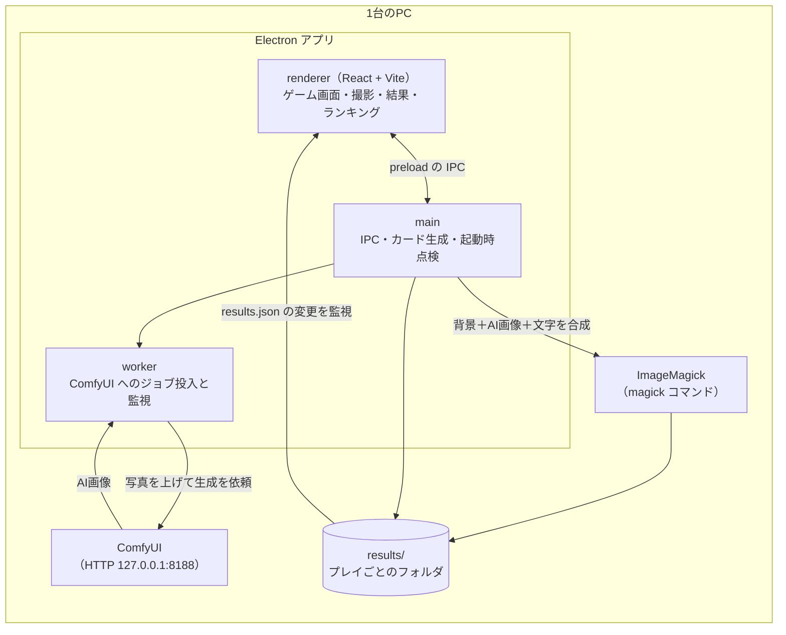

# KidsPG 2026「AIグミパク！」

KidsPG フェスいたみ（2026年9月12日）向けのイベント用アプリです。
（企画上の呼称は「3Dグミ一筆食べパズル」。**表に出すタイトルは「AIグミパク！」**に統一しています）
**顔を撮影 → AI でアニメ調に変換 → スコアと合成してトレーディングカードを生成 → ランキング表示**
までを1台のPCで完結させます。

昨年（2025）の「よけまくり中」のプラットフォームを流用し、**ゲーム部分だけを差し替えた**ものです。

---

## 目次

- [システム構成](#システム構成)
- [動作要件](#動作要件)
- [リポジトリに含まれないもの（別途用意が必要）](#リポジトリに含まれないもの別途用意が必要)
- [起動方法（動作確認はここだけ読めば足ります）](#起動方法動作確認はここだけ読めば足ります)
- [検証ツール](#検証ツール)
- [1プレイの流れ](#1プレイの流れ)
- [設定（config.json）](#設定configjson)
- [ディレクトリ構成](#ディレクトリ構成)
- [開発](#開発)
- [トラブルシューティング](#トラブルシューティング)
- [関連ドキュメント](#関連ドキュメント)

---

## システム構成

1台のPCの中で3つのプロセスが動きます。**アプリは ComfyUI と ImageMagick を
外から叩くだけ**で、どちらが落ちてもゲームとランキングは動き続けます
（カードはプレースホルダのまま残り、あとから救済ツールで作り直せます）。



| 部品 | 役割 | 落ちたときどうなるか |
|---|---|---|
| renderer | パズル・撮影・結果表示・ランキング（別ウィンドウ） | — |
| main | 撮影の保存、カード合成の指揮、起動時の整合性点検 | アプリ全体が止まる |
| worker | ComfyUI への投入と完了待ち（別スレッド） | AI画像が来ない。カードはプレースホルダのまま |
| ComfyUI | 写真をアニメ調へ変換（img2img + ControlNet） | 同上。ゲームは通常どおり遊べる |
| ImageMagick | カードの合成（背景＋AI画像＋文字） | **カードが1枚も出ない**（必須） |
| results/ | 成果物の置き場。1プレイ＝1フォルダ | — |

**記録の正本は各プレイの `results/<日時>/result.json`** です。
`results/results.json` はランキング画面が読む表示用のキャッシュで、
直近と上位の数十件しか持ちません（3000人規模では溢れる前提の設計）。

---

## 動作要件

| 区分 | 内容 |
|---|---|
| **必須** | Node.js 20 以上（v24.16.0 で動作確認） |
| **必須** | ImageMagick 7（`magick` が PATH にあること）。**無いとカードが1枚も出ません** |
| 任意 | ComfyUI（AI変換用）。無くてもゲーム・カード・ランキングは動きます |
| 任意 | Webカメラ。無い場合は自動でダミー写真モードになります（[制約あり](#カメラが無い場合)） |

### はじめて動かすとき

1. **Node.js 20 以上**と **ImageMagick 7** を入れる（`magick -version` が通ること）
2. `npm ci` で依存を入れる
3. AI変換まで試すなら **ComfyUI** を用意する。手順とモデルの入手先は
   **[docs/comfyui-local-setup.md](docs/comfyui-local-setup.md)** にまとめてある
   （DreamShaper 8 / Hyper-SD15-8steps-CFG-lora / ControlNet Canny の3つが要る）
4. ComfyUI の場所が違う場合は `config.json` の
   `comfyui.profiles.local.baseUrl` を自分の環境に合わせる
5. `npm start`

AI変換を飛ばしても **ゲーム・カード・ランキングは動きます**（カードの絵は
アニメ調の固定プレースホルダになります）。まず動かして確認したいだけなら
これで十分です。

> 以下の手順に出てくる `C:\WORK\AI\ComfyUI_20260902_0.34.0\ComfyUI` は
> **開発機での置き場所の例**です。自分の環境に読み替えてください。

---

## リポジトリに含まれないもの（別途用意が必要）

**このリポジトリにあるのはソースと設定だけです。** 以下は clone しても付いてきません。

### ソフトウェア

| 必要なもの | 版 | 確認コマンド | 無いとどうなるか |
|---|---|---|---|
| Node.js | 20 以上（v24.16.0 で動作確認） | `node -v` | ビルドも起動もできない |
| **ImageMagick 7** | `magick` が PATH にあること | `magick -version` | **カードが1枚も出ない** |
| Python | 3.12（ComfyUI の venv 用） | `python --version` | AI変換が使えない |
| ComfyUI | 0.34.0 で動作確認 | `curl http://127.0.0.1:8188/system_stats` | AI変換が使えない（ゲームは動く） |
| PyTorch | CPU 版 or CUDA 版 | — | ComfyUI が起動しない |
| Meiryo（`C:/Windows/Fonts/meiryo.ttc`） | Windows 同梱 | — | カードの文字が描けない |

**カスタムノードは1つも要りません。** ワークフローは ComfyUI の標準ノードだけで
組んであります（当日PCに追加インストールを要求しないため）。

構築手順は **[docs/comfyui-local-setup.md](docs/comfyui-local-setup.md)** にあります。

### AI モデル（合計 約4.1GB）

`config.json` の `activeProfile` が **`local`（CPU実行・SD1.5）** のとき必要なのは
次の4本です。**名前とフォルダを変えないこと**——
`assets/ComfyUI_KidsPG_2026_local.json` がこの名前で参照しており、
違うと ComfyUI が「モデルが無い」で失敗して全員のカードがプレースホルダのままになります。

| 置き場所 | ファイル名 | サイズ | 入手元 |
|---|---|---:|---|
| `models/checkpoints/` | `DreamShaper_8_pruned.safetensors` | 2,132,625,894 | [Lykon/DreamShaper](https://huggingface.co/Lykon/DreamShaper) |
| `models/vae/` | `sd-vae-ft-mse.safetensors` | 334,643,276 | [stabilityai/sd-vae-ft-mse](https://huggingface.co/stabilityai/sd-vae-ft-mse) の `diffusion_pytorch_model.safetensors` を改名 |
| `models/controlnet/` | `control_v11p_sd15_canny.safetensors` | 1,445,157,124 | [lllyasviel/sd-controlnet-canny](https://huggingface.co/lllyasviel/sd-controlnet-canny) の `diffusion_pytorch_model.safetensors` を改名 |
| `models/loras/` | `Hyper-SD15-8steps-CFG-lora.safetensors` | 269,127,064 | [ByteDance/Hyper-SD](https://huggingface.co/ByteDance/Hyper-SD) |

一括で取るスクリプトを用意しています（サイズ検証つき）。

```bash
bash tools/dl-models-local.sh C:/WORK/AI/models
```

> **社内 LAN の AI サーバーからは、いまこの4本は取れません。**
> 2026-09-08 に確認した時点で、共有ストアにあるのは `server` プロファイル用の
> SDXL だけでした（詳細と確認方法は
> [docs/comfyui-local-setup.md](docs/comfyui-local-setup.md)）。
> LAN から取れるようになれば `bash tools/fetch-models.sh C:/WORK/AI/models local` が使えます。

> サイズは 2026-09-08 に実機のファイルと HuggingFace の `Content-Length` が
> **バイト単位で一致することを確認**した値です。ダウンロード後に検証するので、
> 途中で切れたファイルを掴んだままにはなりません。

`steps: 8` は **Hyper-SD の LoRA が 8 ステップ前提**だからです。下げると絵が崩れます。

### GPU 機で動かす場合（`server` プロファイル）

SDXL の別セット（合計 約10.6GB）が必要です。`tools/dl-models.sh` があります
（社内 AI サーバーから取る `tools/fetch-models.sh` もありますが、社外では使えません）。
期待サイズは [docs/comfyui-local-setup.md](docs/comfyui-local-setup.md) に記載しています。

### ハードウェア

| | 内容 |
|---|---|
| Webカメラ | 無くてもダミー写真モードで動きます（[制約あり](#カメラが無い場合)） |
| GPU | 無くても動きます。**CPU実行だと1枚あたり約170秒**かかります（この開発機 Intel Core 7 150U での実測） |


## 起動方法（動作確認はここだけ読めば足ります）

### 手順

```bash
# 0. 依存パッケージ（初回のみ）
npm ci

# 1. ComfyUI を起動する（AI変換を使う場合。使わないなら飛ばしてよい）
#    別ウィンドウで実行し、起動しっぱなしにする
C:\WORK\AI\ComfyUI_20260902_0.34.0\ComfyUI\start-comfyui.bat

#    アプリの「テスト・設定」ページの［ComfyUI を起動する］でも同じことができます
#    （設定の「ComfyUI の場所（物理パス）」を参照）

#    起動完了の確認（JSON が返れば OK。初回は数分かかります）
curl http://127.0.0.1:8188/system_stats

# 2. アプリをビルドして起動
npm start
```

`npm start` は `npm run build`（TypeScript と Vite のビルド）→ `electron .` を続けて実行します。
**ビルドを挟むので、ソースを変更したら毎回 `npm start` を使ってください。**

### 起動後に確認できること

1. TOP 画面 →「はじめる」
2. 撮影画面でニックネームを選んで撮影
3. カウントダウン → パズル（90秒）
4. 結果画面 → **カードが `results/<日時>/memorial_card_<日時>.png` に出力される**
5. ランキング画面にカードが並ぶ

AI変換はゲーム中に裏で走ります。**このPC（GPU 無し）では1枚あたり約3分**かかるため、
結果画面ではまず AI 無しのカード（`.dummy.png`）が出て、生成が終わり次第
本カード（`.png`）へ差し替わります。

### ComfyUI が起動していない場合

アプリは起動時に ComfyUI へ疎通確認し、**繋がらなければダイアログで警告します**。
そのままでも遊べますが、カードの絵は**全員同じプレースホルダ**になります。

> **撮影した本人の写真はカードに焼き込みません。**
> カードは後日ネットで公開する方針のため、生の顔写真を載せるとそのまま公開物になるためです（2026-09-02 判断）。

### カメラが無い場合

カメラが見つからないと自動でダミー写真モードになり、撮影画面はダミー画像を表示します。
この場合 **AI変換は実行されません**（ダミー画像がそのまま `photo_anime_*` として使われます）。

**AI変換込みで動作確認したいがカメラが無い**、というときは、
下の [検証ツール](#検証ツール) の `e2e-local-play.cjs` を使ってください。
実アプリを起動して本番と同じ経路を通し、任意の画像で通しを再現できます。

---

## 検証ツール

いずれも `npm run build` 済みであることが前提です（dist が古いと実行前に止まります）。

```bash
# ComfyUI 単体。疎通・ワークフロー検証・生成時間の実測（CPU 実行では1枚約3分）
node tools/comfyui-smoke.cjs
node tools/comfyui-smoke.cjs --photo tmp/test_face.png --runs 2   # 2回測ってウォーム値を見る

# アプリ込みの通し。実 Electron を CDP で駆動し、本番と同じ IPC 経路で検証する
node tools/e2e-local-play.cjs --photo tmp/test_face.png
node tools/e2e-local-play.cjs --plays 2                # 連続プレイ（キューが進むか）
node tools/e2e-local-play.cjs --no-ai                  # ComfyUI を止めた状態での経路

# 単体テスト（実機不要・1秒で終わる）
node --test tools/test-workflow-template.cjs tools/test-magick-script.cjs
```

`e2e-local-play.cjs` が確認すること:

1. 撮影写真の保存（PNG として妥当か）
2. `image_generate.json` の変数置換と、プレイごとの seed 振り直し
3. プレースホルダ版カードの生成
4. ComfyUI の生成画像の到着
5. AI画像を前景にしたカード（プレースホルダ版と**バイト単位で異なる**ことまで確認）
6. `results.json` の `recent` / `ranking_top` 双方が正しいカードを指し、実体も存在すること
7. ランキング画面が**実際にカード画像を描画している**こと

---

## 1プレイの流れ

```
[TOP] → [CAMERA] 撮影(300x300) ＋ ニックネーム選択
   → savePhoto: results/YYYYMMDD_HHMMSS/photo_*.png 保存
                ワークフローの変数置換 + seed 振り直し → image_generate.json
                ComfyUI へアップロード＆変換開始（★ここで始まる）
→ [COUNTDOWN] 3-2-1
→ [GAME] 120秒（config.json の timeLimitSeconds）← この裏でAI画像生成が走る
→ [RESULT] ランク算出 → result.json 保存
                → カード生成（AI画像が未着ならプレースホルダ版を先に出す）
                → results.json 更新 → ランキング画面が自動リロード
                → 自動的に TOP へ
```

**AI変換はゲームより時間がかかります**（この機体では1枚あたり約170秒）。
そのため結果画面ではプレースホルダのカードを先に見せ、AI画像が出来たら
ランキング画面のカードが差し替わります。**子どもを生成待ちで待たせません。**
1枚あたりの実測と、間に合わないときの逃げ道は
[1枚あたりの生成時間と、間に合わないときの退避](#1枚あたりの生成時間と間に合わないときの退避) を参照してください。

ゲームの差し替え点は `GummyGameEngine` の6メソッドに閉じており、
結果画面以降は昨年のフローがそのまま動きます。

---

## 設定（config.json）

### ComfyUI のプロファイル切替

ローカルPC（GPU 無し）と AIサーバー（GPU 有り）を **`activeProfile` の1語で切り替えます。**

```json
"comfyui": {
  "activeProfile": "local",
  "outputPrefix": "photo_anime",
  "profiles": {
    "local":       { "baseUrl": "http://127.0.0.1:8188",
                     "templatePath": "assets/ComfyUI_KidsPG_2026_local.json" },
    "local_light": { "baseUrl": "http://127.0.0.1:8188",
                     "templatePath": "assets/ComfyUI_KidsPG_2026_local.json" },
    "server":      { "baseUrl": "http://192.168.1.10:8188",
                     "templatePath": "assets/ComfyUI_KidsPG_2026_01.json" }
  },
  "maxConcurrentJobs": 1
}
```

- 存在しないプロファイル名を書いた場合、**黙って既定へ倒さず起動時に警告します**
  （重いワークフローを低スペック機で回して気づかない、という事故を防ぐため）
- `outputPrefix` はプロファイル側に置かないこと。`photo_anime_` を探す箇所がハードコードです
- `maxConcurrentJobs` は **1**。ComfyUI は prompt を1件ずつ直列に実行するため、
  増やしても速くならずキューに積まれるだけです

**AI変換を当日オフにする**には `comfyui` セクションごと外してアプリを再起動します。

### ComfyUI の場所（物理パス）

**同一PCで ComfyUI を動かしているプロファイルにだけ** `paths` を書きます。
アプリと ComfyUI のやり取りは `baseUrl`（HTTP）で足りていて、ここは
**アプリから ComfyUI を起こす**ためと、当日 input / output を目で確かめるためだけに使います。

```json
"local": {
  "baseUrl": "http://127.0.0.1:8188",
  "paths": {
    "root":     "C:\\WORK\\AI\\ComfyUI_20260902_0.34.0\\ComfyUI",
    "input":    "C:\\WORK\\AI\\ComfyUI_20260902_0.34.0\\ComfyUI\\input",
    "output":   "C:\\WORK\\AI\\ComfyUI_20260902_0.34.0\\ComfyUI\\output",
    "startBat": "start-comfyui.bat"
  }
}
```

- `root` は**絶対パス必須**。相対で書くと Electron の作業フォルダを基準に解決されて
  見当違いの場所を掘るので、**使わずに起動時の警告へ回します**
- `input` / `output` / `startBat` は省略か `root` からの相対でよい。省略すると
  `root\input` / `root\output` / （起動ボタンなし）になります。
  **ComfyUI を新しい版へ差し替えたときは `root` の1行だけ直せば足ります**
- `server` プロファイルには**書きません**。別の機体なので、この PC からは起動もフォルダも開けません
- プロファイル側に `paths` があれば、共通側とは**混ぜず丸ごとそちらを使います**。
  `root` だけ差し替えて `input` を共通側から拾うと、別の版フォルダの input を見にいく
  組み合わせができてしまうためです

テスト・設定ページに次のボタンが出ます。

| ボタン | すること |
|---|---|
| ［ComfyUI を起動する］ | `startBat` を **開いたままの PowerShell ウィンドウ**で実行する。すでに応答していれば起動しない |
| ［input を開く］ / ［output を開く］ | そのフォルダをエクスプローラーで開く |

**PowerShell の窓は意図的に閉じません**（`-NoExit`）。ComfyUI はモデルの読み込みに
数十秒かかり、失敗したときの理由もその窓の中にしか出ません。当日スタッフはログファイルを
開けないので、画面に残っているのが唯一の手がかりになります。ComfyUI を止めるのも
その窓を閉じる操作です。アプリを終了しても ComfyUI は動き続けます（逆も同じ）。

### 1枚あたりの生成時間と、間に合わないときの退避

**実測（2026-09-07 / この機体 Intel Core 7 150U・CPU実行・温まった状態）**

2026-09-07 に `inputSize` を 448 → **384** へ落としました。実測で **1枚あたり 約170秒**です。
落とす前は 259〜265秒（約4分20秒）かかっていました。内訳は次のとおりで、ほぼ全部が
ComfyUI の生成時間です（下表は 448 のときの計測）。

| 工程 | 時間 |
|---|---:|
| ComfyUI の生成 | 256〜262秒 |
| └ サンプリング8ステップ | 220秒（1ステップ約27.6秒） |
| └ VAE エンコード/デコード・Canny・CLIP など | 約36秒 |
| ImageMagick でのカード合成 | 2秒 |

ダミーカードは撮影から126秒（プレイ時間120秒＋合成6秒）で出ます。これは生成待ちでは
なくプレイ時間に連動するだけなので、**結果画面で子どもを待たせることはありません**。
AIカードは後からランキング画面に差し替わります。

**画質を落として時間を詰める（昨年と同じ手）**

`inputSize` を下げます。時間はほぼ画素数に比例します。

| inputSize | 生成時間（実測） | 448比 | 拡大率 | 実写での画質 |
|---|---:|---:|---|---|
| 448 | 231〜255秒 | — | 1.45倍 | 崩れなし（基準） |
| **384（`local` = 既定）** | **169〜173秒** | **−32%** | 1.69倍 | **崩れなし** |
| **320（`local_light` = 退避用）** | **123秒** | **−52%** | 2.03倍 | 顔が流れ、眼鏡の形と色が変わる |
| 256（採用せず） | 86秒 | −67% | 2.54倍 | **背景が色帯に潰れて破綻** |

🔴 **画質の判断は必ず実写の顔で行ってください。** `dummy_photo.png` はもとから
アニメ絵なので、解像度を下げても差がほとんど見えません。実写・同一シードで
比べて初めて上表の差が出ました。SD1.5 は 512×512 で学習されたモデルなので、
下げるほど構図と細部の一貫性が落ちます（448 で既に下限近く、320 以下は実用外）。

カードは 650px で合成するので、下げるほど拡大率が上がって絵が甘くなります。
そこが画質の代償です。

拡大の質は合成側で稼いでいます。ImageMagick の**拡大時の既定フィルタは Mitchell** で
線とまつげがぼやけるため、`-filter Lanczos` ＋ 弱いシャープ（`-unsharp 0x0.75+0.60+0.008`）を
明示しています（5通り出して見比べた結果）。この配線は
`node --test tools/test-magick-script.cjs` が検査します。

切り替え方は2通り。

1. **プロファイルを変える**（推奨・戻しやすい）
   `activeProfile` を `local`（384・170秒）→ `local_light`（320・123秒）にして
   **アプリを再起動**します。**320 は画質が確実に落ちるので最後の手段**です
2. **設定画面から変える**（速い・再起動不要）
   ⚙ を5回タップして設定画面を開き、`inputSize` だけを書き換えて保存。
   生成パラメータは撮影のたびに焼き込むので、**再起動せずに次の1枚から効きます**

⚠️ `steps` は下げないこと（Hyper-SD の LoRA が 8 を前提にしており、絵が崩れます）。
`denoise` を下げても**時間は縮みません**（サンプリング回数は `steps` のままです）。

別の機体では数字が変わるので、本番PCで測り直してください。

```bash
node tools/comfyui-smoke.cjs --gen inputSize=320 --runs 2   # 2回目以降が「温まった」時間
```

**画質の落ち方を見比べる**には、同じ写真・**同じシード**で解像度だけを変えて出します。
シードを振り直したまま比べると、違いが解像度のせいか偶然のせいか分かりません。

```bash
node tools/compare-generation.cjs --photo results/<日時>/photo_<日時>.png --sizes 448,384,320
# tmp/compare/比較.png に、カードと同じ 650px へ揃えた横並びが出ます
```

`local_light` は `local` の複製なので、**片方だけ直すと切り替えた瞬間に絵が変わります。**
`node --test tools/test-quality-fallback.cjs` が「違っていてよいのは inputSize だけ」を
検査します。

### ワークフロー

| ファイル | 用途 | 構成 |
|---|---|---|
| `assets/ComfyUI_KidsPG_2026_local.json` | ローカルPC（GPU 無し） | SD1.5（DreamShaper 8）/ 448×448 / 8step / cfg 5 |
| `assets/ComfyUI_KidsPG_2026_01.json` | AIサーバー（GPU 有り） | SDXL（Animagine XL 4.0）/ 1024×1024 / 8step / cfg 5 |

どちらも **cfg=5** です。cfg=1 にすると倍速になりますが
ネガティブプロンプト（`nsfw` / `horror` 等）が一切効かなくなるため、子ども向けとして採れません。

ワークフローを編集するときの制約は
[assets/ComfyUI_KidsPG_2026_01.README.md](assets/ComfyUI_KidsPG_2026_01.README.md) の「アプリ側との約束」を参照してください。
`node --test tools/test-workflow-template.cjs` がその約束を検査します。

### ゲーム

```json
"game": {
  "timeLimitSeconds": 120,
  "maxStages": 0,
  "stageProgression": [ { "size": 4, "difficulty": "veasy", "multiplier": 8 } ],
  "rankThresholds": [1504, 1216, 928, 640, 392, 200, 88]
}
```

盤は全面 4×4 です。難易度は `core.js` の `DIFFICULTY` が **2つの別の軸**で決めます
（veasy / easy / normal / hard / vhard）。

| 軸 | 設定 | 意味 |
|---|---|---|
| 長さ | `ratio` | 残すグミの割合。**所要時間とスコアを決める軸で、難しさではない** |
| 難しさ | `minCriticals` | **間違えると詰む判断**の数の目標。`solve.js` のソルバで数え、届く盤面が出るまで引き直す |

🔴 **長さを増やしても難しくはなりません。** 隣接したグミの塊は端から順に食べれば
抜けられることが多く、増えるのは所要時間だけです。難しさを作るのは
「右へ行くべきか上へ行くべきか」の判断で、それを生むのは**通れない場所（穴）と
一本道の配置**です。4×4 は3面ぶんで48セルあり、経路が短いほど穴が多く残るので、
短い盤面でも十分に難しくできます。

実測（各200回の中央値）: グミ数 11 / 14 / 24 / 31 / 36 に対して難所が 0 / 5 / 9 / 12 / 14。
1面目は判断ゼロの一本道で、初めて触る子が確実に抜けられるようにしてあります。

**難しさを変えるときは `ratio` ではなく `minCriticals` を動かしてください**
（長さが変わらないので `rankThresholds` の再計算が要りません）。

`rankThresholds` はカード背景8種と1対1で対応し、**クリアした面の数がそのままランク**に
なるよう置いています。この対応は1面あたりのグミ数に依存するので、
`stageProgression` / `multiplier` / `ratio` を触ったら再計算が必要です。

```bash
node tools/measure-stages.mjs --deep          # 難所の数まで測る
node tools/measure-stages.mjs --plan --deep   # 閾値の候補と部分点の点検も出す
```

`node --test tools/test-stage-balance.mjs` が config と生成器の食い違いを検査します。
**盤面の形は実測できますが子どもの初見クリア率は測れないので、リハーサルで確定させてください。**

---

## ディレクトリ構成

```
kidspg-game-2026/
├── src/
│   ├── main/                        Electron メインプロセス
│   │   ├── main.ts                  IPC・起動時チェック・カード生成の起点
│   │   ├── paths.ts                 results の場所を決める唯一の関数
│   │   ├── services/
│   │   │   ├── comfyui-config.ts    activeProfile の解決
│   │   │   ├── workflow-template.ts ワークフローの変数置換と検証
│   │   │   ├── comfyui-service.ts   ワーカーとの仲介
│   │   │   ├── memorial-card-service.ts / magick-script-generator.ts / image-composition-config.ts
│   │   │   ├── results-manager.ts   results.json と result.json の更新（直列化・アトミック書き込み）
│   │   │   └── ranking-service.ts
│   │   └── workers/comfyui-worker.ts  ComfyUI REST を直叩き
│   ├── renderer/
│   │   ├── pages/                   TOP / CAMERA / COUNTDOWN / GAME / RESULT
│   │   ├── game/
│   │   │   ├── GummyGameEngine.ts   GamePage から見た呼び出し口（昨年と同一）
│   │   │   └── gummy/               core.js（盤面）/ GummyBoard.jsx（three.js）/ GummyGame.jsx（進行）
│   │   └── components/ranking/      ランキング別ウィンドウ
│   ├── shared/                      型定義・定数・helpers
│   └── test/                        カード再生成ツール（npm run recovery）
├── tools/                           検証ツールと通知（下記）
├── assets/                          ワークフロー JSON・アイコン・ダミー画像
├── card_base_images/                カード背景8種
├── config.json                      設定の正本
├── results/                         プレイ結果（gitignore）
└── docs/                            設計・調査メモ
```

> 昨年の 2D 避けゲーの残骸 `src/renderer/game/PixiGameEngine.ts` は削除しました（2026-09-02）。
> `card_base_images/superseded_*/` は差し替え前のカード背景の退避先で、
> パッケージには同梱されません（`package.json` の extraFiles で除外）。

#### カード背景の変遷

カードの意匠は 8 ランクぶんあり、**ランクが上がるほど地色が変わります**
（青 → 緑 → 橙 → 紫 → 珊瑚 → 金 → 虹 → 虹金）。

| 版 | 意匠 | 右上バッジ | いまの置き場所 |
|---|---|---|---|
| 昨年（2025） | 虹色ホログラム枠＋星空 | 「よけまくり中」 | 削除（git 履歴と 2025 版リポジトリに残る） |
| 2026-09-02 | 同上 | 「グミパズル」 | `superseded_20260902/` |
| 2026-09-02 | ミント単色・枠なし | 「AIグミパク！」 | `superseded_20260904/` |
| **現行（2026-09-04）** | **昨年のキラキラ意匠** | **「AIグミパク！」** | `card_base_images/` 直下 |

現行版は、昨年の意匠へミント単色版の右上バッジ
（400×125px・座標 556,60・角丸 R26）だけを切り出して合成したものです。
バッジの絵柄は元のまま移植しているので、書体や白フチは崩れていません。

> ミント単色版は8枚とも同じ地色だったため、ランクが上がった実感が出ませんでした。
> 昨年の意匠に戻したのはそのためです（2026-09-04）。

### tools/

| ファイル | 用途 |
|---|---|
| `comfyui-smoke.cjs` | ComfyUI 単体の検証と生成時間の実測（`--gen` で生成パラメータをその回だけ上書き） |
| `compare-generation.cjs` | 同じ写真・同じシードで生成パラメータだけ変えて画質を見比べる |
| `e2e-local-play.cjs` | 実アプリを CDP で駆動する通しテスト |
| `retry-failed.cjs` | 生成に失敗したプレイの救済（A: AI画像の再投入 / B: カード再合成 / C: パス張り直し） |
| `purge-photos.cjs` | results から**生の顔写真だけ**を消す（既定はドライラン） |
| `place-regen-bat.cjs` | 各結果フォルダへ「再生成.bat」を置く（retry-failed の薄いラッパ） |
| `test-workflow-template.cjs` | ワークフロー置換・「アプリ側との約束」の単体テスト |
| `test-magick-script.cjs` | ImageMagick スクリプト生成の単体テスト |
| `test-png-integrity.cjs` | PNG の完全性判定とカード確定処理の単体テスト |
| `test-startup-consistency.cjs` | 起動時点検の単体テスト |
| `test-retry-failed.cjs` | 救済ツール・救済スクリプトの単体テスト（保守ロックの取り合いを含む） |
| `test-config-writer.cjs` | 設定の書き戻し（型・範囲の検査）の単体テスト |
| `test-purge-photos.cjs` | 写真削除ツールの単体テスト（隔離したフォルダで確認） |
| `test-comfyui-paths.cjs` | ComfyUI の物理パスの解決と、起動コマンドの単体テスト |
| `test-regen-bat.cjs` | 再生成バッチの単体テスト（CRLF・ASCII 先頭・委譲） |
| `test-rank-and-level.cjs` | ランクとレベルの計算の単体テスト |
| `test-solve-stage.mjs` | 難易度ソルバの単体テスト（正解が自明な小グラフ） |
| `test-composition-parity.cjs` | カード合成設定が本体と救済ツールで食い違っていないかの検査 |
| `test-quality-fallback.cjs` | 画質を落とした退避用プロファイルが本番と食い違っていないかの検査 |
| `test-exit-path.cjs` | 終了経路の配線（確認ダイアログ・プロセスが残らないこと）の検査 |
| `test-stage-balance.mjs` | ステージ構成とランク閾値・難所の数の対応の検査 |
| `measure-stages.mjs` | 盤面生成の実測（グミ数・難所の数・閾値の候補） |
| `make-onsite-package.cjs` | 当日PC向けの持ち出しパッケージを作る（USB 用） |
| `onsite-package-lib.cjs` | パッケージの組み立ての決めごと（何を入れ、何を落とすか） |
| `onsite-materials.json` | リポジトリの外の資材の入手元と期待サイズ |
| `onsite/0_setup.bat` | 当日PCで実行するセットアップ（コピーと点検だけ） |
| `test-onsite-package.cjs` | パッケージの組み立ての決めごとの単体テスト |
| `notify.sh` | 作業の節目をスマホへ通知（ntfy） |
| `dl-models-local.sh` | **local プロファイル用（SD1.5・4本）** のモデルを HuggingFace から取得（サイズ検証つき） |
| `dl-models.sh` | server プロファイル用（SDXL・5本）のモデルを HuggingFace から取得 |
| `fetch-models.sh` | 社内 AI サーバーからモデルを取り込む（社外では使えません） |

### results/ の場所を差し替える

イベントPCからコピーした結果を後日別のPCで処理する場合は、`KIDSPG_RESULTS_DIR` に対象フォルダを指定します。
救済系（`tools/retry-failed.cjs` / `npm run recovery`）と後日公開用の4ツール
（`collect-cards` / `create-thumbnails` / `create-image-path-json` / `generate-gallery`）が対応しています。

```bash
KIDSPG_RESULTS_DIR=D:\kidspg-2026\results node tools/retry-failed.cjs
```

> **救済系は results/ に保守ロック（`.maintenance.lock`）を取ります。**
> アプリの起動時点検と同時に走ると、片方が作り直した正常なカードを
> もう片方が「壊れている」と判断して退避してしまうためです。
> 「別のプロセスが results/ を保守中です」と出たときは少し待って再実行してください。
> アプリの強制終了などでロックが残った場合は
> `node tools/retry-failed.cjs --apply --force-unlock` で外せます
> （他に何も動いていないことを確認してから）。

---

## 開発

```bash
npm run build          # main（tsc）と renderer（vite）をビルド
npm start              # build → electron .（動作確認はこれ）
npm run electron       # ビルド済みを起動するだけ

npm run lint           # ESLint
npm run lint:fix
npm run format         # Prettier
npx tsc --noEmit       # 型検査（src/test を含む全体。npm run build より広い）

npm run dist           # 配布パッケージを release/ に作成
npm run dist:win

npm run recovery       # AI画像はあるがカードが無い結果フォルダを救済
npm run recovery:dry   # 上のドライラン
```

> **`npm run electron:dev` はホットリロードとして機能しません。**
> `NODE_ENV=development` を設定していないため、Electron は Vite の開発サーバー（:3000）ではなく
> `dist/renderer/index.html` を読みます。素直に `npm start` を使ってください。

> **`npm run build` は `src/test/` を型検査しません**（`tsconfig.main.json` の include 外）。
> `npm run recovery` 側の型崩れを拾うには `npx tsc --noEmit` を回してください。

---

## トラブルシューティング

実際に踏んだものを挙げます。

| 症状 | 原因 | 対処 |
|---|---|---|
| カードが1枚も生成されない。`no decode delegate for this image format 'C:/Users/owner/OneDrive'` | `magick -script` のパスが引用符で囲われず、空白で分断された | 修正済み。パスは必ず `quotePathForMagick` を通すこと |
| ComfyUI に繋がらないのに誰も気づかない | 起動時チェックが無かった | 修正済み。起動時にダイアログで警告する |
| 31人目以降のカードがどこからも参照されない | `results.json` は表示件数分しか保持しない | 修正済み。正本は各 `results/<日時>/result.json` の `memorialCardPath` |
| 検証ツールは通るのにアプリが直っていない | ツールが `dist` を読むため、ビルド忘れで旧実装を検証していた | 修正済み。dist が src より古ければ実行前に停止する |
| モデルのサイズは合うのに読み込めない | `curl -C -` のレジュームで CDN が本体を追記していた | `dl-models.sh` は `.part` に落とし sha256 まで照合する |
| ComfyUI の初回起動が数分間無反応 | ディスクが忙しいと `comfy_extras` の import が遅い | `/system_stats` が 200 を返すまでが起動完了 |
| 記念カードが生成されない | ImageMagick が無い／`card_base_images/` に背景が無い | 起動時チェックの警告を確認 |

開発者ツールは F12 で開きます。

---

## 関連ドキュメント

| 内容 | パス |
|---|---|
| **残課題（判断待ち・未実施のもの）** | **[docs/open-issues-20260904.md](docs/open-issues-20260904.md)** |
| **当日PCへのセットアップ手順（USB から）** | **[docs/setup-onsite.md](docs/setup-onsite.md)** |
| 配布パッケージの設計（exe を作らない理由ほか） | [docs/distribution-plan.md](docs/distribution-plan.md) |
| ソースコードレビューの結果と対応 | [docs/code-review-20260903.md](docs/code-review-20260903.md) |
| 2025年版残骸のクリーニング計画 | [docs/cleanup-plan-20260904.md](docs/cleanup-plan-20260904.md) |
| 計画書（残日数・撤退ライン・判断事項） | `../docs/計画書.md` |
| ComfyUI 構築手順・当日運用 | [docs/comfyui-local-setup.md](docs/comfyui-local-setup.md) |
| ワークフローの設計と「アプリ側との約束」 | [assets/ComfyUI_KidsPG_2026_01.README.md](assets/ComfyUI_KidsPG_2026_01.README.md) |
| 夜間作業レポート | `../docs/夜間作業レポート_20260901.md` / `_20260902.md` |
| 素材とライセンス | [CREDITS.md](CREDITS.md) |
| 個人情報とデータの取り扱い | `../docs/個人情報とデータの取り扱い.md` |

---

## ライセンス

[MIT License](LICENSE)。同梱素材のライセンスは [CREDITS.md](CREDITS.md) を参照してください。
